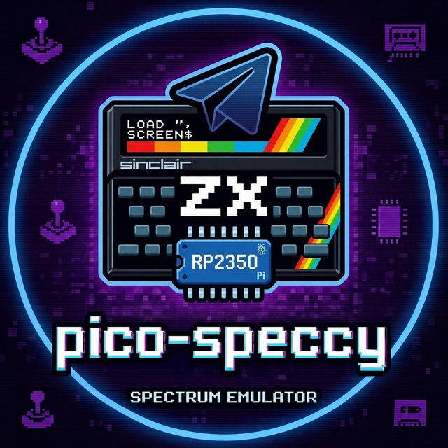

# pico-speccy



This is an emulator of the Sinclair ZX Spectrum compatible computers running on RP2350 SoC powered boards.

Pico-Speccy is based on:
 - [ESPectrum](https://github.com/EremusOne/ESPectrum)
 - [DnCraptor/pico-spec](https://github.com/DnCraptor/pico-spec)
 - [drewpo28/pico-spec](https://github.com/drewpo28/pico-spec)

Board supported:
 - "Murmulator 1.x" + Raspberry "Pi Pico 2" or compatible;
 - "Murmulator 2.0" + Raspberry "Pi Pico 2" or compatible;
 - Waveshare "RP2350-PiZero" + use PCM5122 for best sound;
 - Pimoroni "Pico DV Demo Base" + Raspberry "Pi Pico 2" or compatible;
 - Olimex "RP2040-PICO-PC" carrier board + Raspberry "Pi Pico 2" or compatible.

Best performance for case Pimoroni "Pico Plus 2" is used.

## Features

- ZX Spectrum 48K, 128K, Pentagon 128k/512k/1024k, Profi 1024K, Byte and ALF TV Game. 100% cycle accurate emulation.
- State of the art Z80 emulation (Authored by [José Luis Sánchez](https://github.com/jsanchezv/z80cpp))
- Selectable Sinclair 48K, Sinclair 128K and Amstrad +2 english and spanish ROMs. Byte and ALF TV Game - russian ROMs, + Pentagons with Gluck services ROMs & selectable TR-DOS ROM (5.03 / 5.04TM / 5.05D / custom). Profi 1024K with selectable Karabas-Pro ROM sets (Original, ROMain boot menu, PQDOS, Flash Tool, FDImage).
- Possibility of using custom ROM with easy flashing procedure from SD card.
- ALF TV Game cartridge loading: load any ALF cartridge (up to 1 MB) from the SD card into a dedicated flash region and boot it (RP2350 only).
- ZX81+ IF2 ROM by courtesy Paul Farrow with .P file loading from SD card.
- Timex SCLD video modes emulation (hi-res 512->256 OR-merge, hi-color, dual-screen).
- Pentagon 16-color video mode (Pentagon only): per-pixel 16-color attribute mode toggleable from the OSD Video menu.
- Profi DS80 512×240 hi-res video mode (Profi only): switchable STD/DS80 output with a dedicated OSD palette option; CP/M and TR-DOS supported (RP2350 only).
- Karabas-Pro emulation on Profi: selectable flash ROM sets (Original, ROMain boot menu, PQDOS, Flash Tool, FDImage) switchable from setup or the **Menu** (Win) key hotkeys — Menu+F1–F4 pick a ROM set, plus Menu combos for Turbo FDC, AY stereo, CPU speed, drive swap and more (see F1 Help) — and serial (COM) mouse emulation for CP/M software (RP2350 only).
- VGA/HDMI output with 4 selectable video modes: 640x480@60Hz, 640x480@50Hz, 720x480@60Hz, 720x576@50Hz.
- Hot video mode switching without reboot (VGA/HDMI).
- VGA/HDMI scanlines effect with 5 selectable brightness levels (Off, Darkest, Dark, Light, Lightest).
- VGA/HDMI CRT filter with 7 selectable levels (Off, Soft, Medium, Strong, Grille soft/med/hard): gamma correction, phosphor tint, black lift and a vertical aperture-grille mask.
- HDMI dither effect for ULA+ (RP2350 only): optional Bayer-look palette dithering applied via ISR.
- HDMI audio output (RP2350 only).
- TV-composite video out.
- PCM5122 I2S audio DAC support (Waveshare PiZero boards - https://www.waveshare.com/wiki/PCM5122-Audio-Board-A).
- Multicolor attribute effects emulated (Bifrost*2, Nirvana and Nirvana+ engines).
- Border effects emulated (Aquaplane, The Sentinel, Overscan demo).
- Floating bus effect emulated (Arkanoid, Sidewize).
- Snow effect accurate emulation (as [described](https://spectrumcomputing.co.uk/forums/viewtopic.php?t=8240) by Weiv and MartianGirl).
- Gigascreen support (Choose between three modes: Off, On, or Auto; memory released when Off) (RP2350 only).
- Selectable color palettes: Pulsar (default), Alone, Grayscale, Mars, Ocean (Unreal Speccy compatible format).
- Custom palettes support: load user-defined palettes from `/palette.nvs` file on SD card (up to 11 custom palettes, 3x3 RGB color transform matrix).
- Ula+ support (https://sinclair.wiki.zxnet.co.uk/wiki/ULAplus).
- Murmuzavr (up to 32 MB) support.
- Z80 DMA / zxnDMA emulation: Port #0B (MB02+) and Port #6B (DATA-GEAR) modes (RP2350 only).
- Contended memory and contended I/O emulation.
- AY-3-8912 / TurboSound emulation.
- SAA1099 sound chip emulation (https://en.wikipedia.org/wiki/Philips_SAA1099).
- Covox 8-bit DAC emulation: selectable port (#FB or #DD) from the Audio menu.
- SounDrive 8-bit stereo DAC emulation: left channel on ports #0F/#1F/#3F, right on #4F/#5F, both on #FB. Own Audio-menu item (Off/On/Auto; Auto enables it on Profi only, where CP/M games stream PCM there).
- General Sound (GS) emulation: dedicated Z80 with selectable clock (12/13/14/20/24 MHz) on core1 with 2 MB sample RAM, ring-buffered DAC, host→GS FIFO for no-handshake loaders. Auto-enabled on RP2350 boards with butter PSRAM.
- MIDI support: external UART output (AY bit-bang, ShamaZX), a built-in procedural software synthesizer, and a **GM.DLS wavetable synth** that plays a real General MIDI sound bank loaded from SD (RP2350 only).
- Beeper & Mic emulation (Cobra’s Arc).
- Dual keyboard support: you can connect two devices: first using PS/2 protocol and second using USB at the same time.
- Dual USB host on Waveshare RP2350-PiZero: the second USB Type-C port (J2) works as an extra USB host via PIO-USB, so two USB devices (e.g. keyboard + gamepad) can be connected without a hub.
- PS/2 Joystick emulation (Cursor, Sinclair, Kempston and Fuller).
- Two real joysticks support (Up to 8 button joysticks).
- USB HID gamepad support: XInput (Xbox 360/One), DualShock 4 (PS4), DualSense (PS5), generic HID gamepads with auto-detected report descriptors and analog trigger support.
- Emulation of Betadisk interface with four drives and TRD, SCL, UDI, FDI (read and write) and TD0 (Teledisk, read-only) support. Fast and realtime modes. Per-drive Write Protect, inline drive status in the Drives menu, F5 slot-picker popup (F2 toggle WP, F8 eject) when mounting from the file browser.
- TR-DOS auto-boot: optionally inject a boot loader into TRD/SCL images that lack one, so downloaded disks auto-start (Storage → Betadisk → Auto-boot) (RP2350 only).
- IDE/HDD emulation: NEMO and Profi schemes, HDF / raw .hdd / Fixed VHD images, create-empty-image helper, mounted from the Storage → IDE/HDD menu (RP2350 only).
- MB-02+ disk interface emulation: WD2797 FDC, Z80-DMA, 512KB SRAM paging, BS-DOS 308, MBD disk images, 4 drives, NMI menu (RP2350 only).
- USB flash drive support: browse and load images from a USB mass-storage stick (mounted as a FatFs `USB:` volume) at ~0.9 MB/s; appears as a location in the F5 file browser and, when no SD card is present at boot, becomes the default storage (RP2350 only).
- SD card hot-insert: a card inserted after boot is mounted automatically, no reboot needed.
- esxDOS support (DivMMC, DivIDE, DivSD) — [esxdos.org](https://esxdos.org/index.html).
- Z-Controller emulation: raw SD card access via ports #57/#77, mutually exclusive with esxDOS and MB-02+ (RP2350 only).
- FDD activity LED indicator and mechanical head click/seek sound emulation (optional, toggled via Betadisk menu).
- ZiFi WiFi network interface via an ESP-01S module (stock Espressif AT firmware — no reflash): network access for ZX-Spectrum software (e.g. the MRF terminal), plus an MC146818 RTC (Pentagon "Mr Gluk" TimeKeeper) with SNTP time sync over WiFi (RP2350 only).
- Unified F5 file browser with a location chooser (RP2350, when WiFi is configured): **Local (SD)**, **Remote (FTP/SFTP)**, **Web Archives** and **Add Remote** — all rendered in the same "Open File" window. **Enter** quick-starts a file (downloads to RAM and runs/mounts), **F5** saves it to a chosen SD folder; `..`/Backspace go up a level, Esc closes. Per-source listing cache (with manual F2 refresh) and remembered cursor/last location.
- Network file transfer (FTP / SFTP / SSH client): saved connections with optional alias and start path (passwords optionally stored, masked entry; TAB reveals); browse / download / upload / copy (recursive) / delete; SSH/SFTP crypto (curve25519, AES-CTR, HMAC-SHA256) runs on the RP2350 via mbedTLS; SFTP host-key trust-on-first-use; selectable ESP-01S UART baud up to 921600. See the [Network wiki page](https://github.com/drewpo28/pico-speccy/wiki/EN-Network).
- Web Archives: browse and download ZX disk/tape images and ALF cartridges from online catalogs (Virtual TR-DOS, Spectrum Computing, ZX-Art, ALF) over HTTPS straight to SD or RAM. Serverless GitHub-Pages catalog, on-device TLS, Cyrillic titles rendered (RP2350 only).
- FTP server: share the SD card over the LAN (anonymous, active mode) from the Network menu (RP2350 only).
- Realtime (with OSD) TZX, TAP and PZX file loading.
- Flashload of TZX/TAP/PZX files (standard loaders only).
- Rodolfo Guerra's ROMs fast load routines support with on the fly standard speed blocks translation.
- TAP file saving to SD card.
- SNA and Z80 snapshot loading.
- Snapshot saving and loading with named slots. Quick load/save hotkeys.
- ZIP archive support: browse, extract, load and delete files inside ZIP archives.
- Configurable keyboard hotkeys with hint display in menus.
- Enhanced debugger: multi-breakpoint (up to 20), memory editor, port read/write breakpoints.
- Hardware info menu: Chip Info (model, cores, frequency, VREG voltage), Board Info (flash, PSRAM, SDK version), Memory Info (live SRAM/PSRAM/flash occupancy and Buffer tier pools) and Emulator Info (machine, video, sound, input and storage configuration).
- Speed Test menu: benchmark CPU MIPS, SRAM read/write, PSRAM, SD card and USB drive throughput (individual or all at once).
- ZX Keyboard overlay (main menu → ZX Keyboard): full-screen bitmap of the Spectrum keyboard for quick reference. Thanks to @const_bill and @tecnocat.
- Overclock menu: CPU frequency (252/378/504 MHz), Flash frequency (33–166 MHz), PSRAM frequency (66–166 MHz), VReg voltage (1.15–1.80 V).
- Complete file navigation system with autoindexing, folder support and search functions.
- Complete OSD menu (English).
- On-screen LED indicators: real-time overlay showing FDD activity, SD card, IDE/HDD, MIDI TX, tape, network (ZiFi TX/RX), and other port-driven hardware states.
- Volume boost: configurable audio amplification (0–64) in the Audio menu.
- Factory reset: hold R at boot to wipe all settings and restore defaults — an on-screen prompt guides the hold window, works with PS/2 and USB keyboards (with confirmation prompt).
- BMP screen capture to SD Card (thanks David Crespo 😉).

## Byte Emulation Details (https://zxbyte.org/)

- 48K ROM (no Beta Disk interface — Betadisk is switched off automatically when this model is selected)
- 128K ROM + TR-DOS
- 128K ROM + TR-DOS + Mr. Gluk Reset Service
- Sovmest (COBMECT) Mode (more accurate emulation of a real ZX Spectrum 48/128)
- Support for the KR580VI53 (a clone of the Intel 8253) three-channel timer

## Installing

You can flash the binaries directly to the board: [Releases](https://github.com/drewpo28/pico-speccy/releases)

## Keyboard functions

Default hotkey bindings (all hotkeys except F1 and ALT+F1 are reconfigurable via OSD menu):

- F1 Main menu
- F2 Load (SNA,Z80,P)
- F3 Load custom snapshot
- F4 Save custom snapshot
- F5 Load file (TAP, TZX, PZX, TRD, SCL, UDI, FDI, MBD, SNA, Z80, MMC, HDF, DSK, ZIP) — opens a location chooser (Local / Remote / Web Archives) when WiFi is configured (RP2350)
- F6 Play/Stop tape
- F7 Tape Browser
- F8 CPU / Tape load stats ( [CPU] microsecs per CPU cycle, [IDL] idle microsecs, [FPS] Frames per second, [FND] FPS w/no delay applied )
- F9 Volume down
- F10 Volume up
- F11 Hard reset
- F12 Reset RP2350
- ~ (Tilde) Max speed toggle
- Pause Pause
- ALT+F1 Hardware info
- ALT+F2 Turbo mode
- ALT+F5 Debug
- ALT+F6 Disk menu
- ALT+F8 Toggle LED indicators
- ALT+F9 Input poke
- ALT+F10 NMI (Pentagon: modal menu with NMI / Magic Button options)
- ALT+F11 Reset to... (modal menu: Service/Gluk/Service ROM, TR-DOS, 128K, 48K — depends on machine; Profi has its own Service ROM / TR-DOS / 128K / 48K set)
- ALT+F12 USB Boot / Update Firmware
- ALT+PageUp Switch Gigascreen mode (Off → On → Auto cycle)
- ALT+F3 Quick load snapshot
- ALT+F4 Quick save snapshot
- ALT+CTRL+Home Switch HDMI video mode (60Hz cycle)
- ALT+CTRL+End Switch HDMI video mode (50Hz cycle)
- PrntScr BMP screen capture (Folder /spec/.c at SDCard)
- WASD/KL - Kempston joystick parallel-emulation
- Menu (Win) key (Profi / Karabas-Pro): ROM-set and quick-setting hotkeys — press F1 for the full list

## How to flash custom ROMs

Two custom ROMs can be installed: one for the 48K architecture and another for the 128K architecture.

The "Update firmware" option is now changed to the "Update" menu with three options: firmware, custom ROM 48K, and custom ROM 128K.

Just like updating the firmware requires a file named "firmware.bin" in the root directory of the SD card, for the emulator to install the custom ROMs, the files must be placed in the mentioned root directory and named as "48custom.rom" and "128custom.rom" respectively.

For the 48K architecture, the ROM file size must be 16384 bytes.

For the 128K architecture, it can be either 16kb or 32kb. If it's 16kb, the second bank of the custom ROM will be flashed with the second bank of the standard Sinclair 128K ROM.

It is important to note that for custom ROMs, fast loading of taps can be used, but the loading should be started manually, considering the possibility that the "traps" of the ROM loading routine might not work depending on the flashed ROM. For example, with Rodolfo Guerra's ROMs, both loading and recording traps using the SAVE command work perfectly.

Finally, keep in mind that when updating the firmware, you will need to re-flash the custom ROMs afterward, so I recommend leaving the files "48custom.rom" and "128custom.rom" on the card for the custom ROMs you wish to use.

## MIDI Support

The emulator supports MIDI output on RP2350 boards only. Enable it in the OSD menu: **Audio → MIDI**.

Four modes are available:

- **AY** — Decodes bit-bang UART transmitted through AY-3-8912 register 14 (IOPortA, bit 2). Software like [zx-midiplayer](https://github.com/UzixLS/zx-midiplayer) uses this method in "128std" / "TS1" / "TS2" output modes. MIDI bytes are sent to an external synth via UART TX pin at 31250 baud.
- **ShamaZX** — Emulates the ShamaZX parallel MIDI interface (SAM2695 synth module). Port 0xA0CF is used for TX data, port 0xA1CF for status (bit 6 = busy). This corresponds to the "ShamaZX" output mode in [zx-midiplayer](https://github.com/UzixLS/zx-midiplayer). Output via UART TX pin.
- **Software** — Built-in software MIDI synthesizer. No external hardware needed — MIDI is synthesized directly on the RP2350 and mixed into the audio output. Supports 16-voice polyphony, General MIDI program changes, velocity, channel volume, expression, pan, and pitch bend. Works with both AY bit-bang and ShamaZX protocols. When Software mode is selected, a **Synth Preset** submenu appears with 8 presets:
  - **GM** — General MIDI mapping: different waveforms per instrument family (triangle for piano/pipes, saw for strings/bass, square for organs/brass, noise for percussion).
  - **Piano** — All instruments rendered as triangle wave with natural decay.
  - **Chiptune** — All square wave with varied duty cycles, no filtering — classic 8-bit sound.
  - **Strings** — All saw wave, slow attack, long sustain, warm low-pass filter.
  - **Rock** — Bright and punchy: saw for most instruments, square for organ/brass/reed.
  - **Organ** — All square wave (75% duty), sustained tone with minimal decay.
  - **Music Box** — Triangle wave with fast decay and low sustain — delicate and percussive.
  - **Synth** — All saw wave with medium low-pass filter.
- **GM.DLS Wavetable** — A fixed-point General MIDI **wavetable** synthesizer that plays a real GM sound bank, for far more realistic instruments than the procedural Software synth. No external hardware. You supply the bank (`gm_bank.bin`): pack it once on a PC, copy it to the SD card, and select this mode — the device installs the bank into a dedicated flash partition on the next boot (one-time write, ~20–30 s, LED blinks). The bank then persists across reboots and firmware updates.

### GM.DLS instrument bank

The GM.DLS wavetable mode needs a packed `gm_bank.bin` on the SD card — it is **not** included, you provide your own. Convert a sound bank on a PC with the bundled pure-Python tools (no dependencies), packed at the emulator's 31250 Hz rate:

- DLS bank (e.g. Microsoft `gm.dls`): `python3 tools/dls_pack.py gm.dls gm_bank.bin 31250`
- GUS / freepats patch set: `python3 tools/gus_pack.py timidity.cfg gm_bank.bin 31250`

Copy the resulting `gm_bank.bin` (~1.6 MB, 8-bit µ-law) to `/gm_bank.bin` or `/.config/pico-speccy/gm_bank.bin` on the SD card, then select **Audio → MIDI → GM.DLS Wavetable**. To update/reinstall, drop a new bank on SD and re-select the mode (confirm the reinstall prompt). When the SD card holds more than one bank, an **Instrument set** picker lets you choose which one to install. Requires a board with ≥ 4 MB flash.

> Microsoft's `gm.dls` is copyrighted and **not redistributable** — pack your own copy for personal use, or use the freely-licensed [freepats](https://freepats.zenvoid.org/) GUS set.

The GM.DLS wavetable engine and the `dls_pack` / `gus_pack` conversion tools are based on **[xrip/embedded-midi-synth](https://github.com/xrip/embedded-midi-synth)** — thanks to **[@xrip](https://github.com/xrip)**. Full details: the [MIDI wiki page](https://github.com/drewpo28/pico-speccy/wiki/EN-MIDI).

### MIDI TX Pin Configuration

The MIDI TX pin is configured per board in `CMakeLists.txt` via `MIDI_TX_PIN`. Default values by board:

| Board | MIDI_TX_PIN |
|-------|-------------|
| Murmulator | 22 |
| Waveshare PiZero | 26 |
| Pimoroni Pico DV | 21 |
| Olimex RP2040-PICO-PC | 22 |

**Note:** On Murmulator boards, MIDI TX and real tape input share the same pin (GPIO 22). When MIDI is enabled, real tape loading is disabled. Disable MIDI in the menu to use real tape input.

### Connecting to Raspberry Pi 3/4 as MIDI Host

You can use a Raspberry Pi 3 or 4 as a USB MIDI host with a hardware synth or software synthesizer (e.g. FluidSynth).

**Wiring** (directly, no optocoupler needed for short connections):

```
RP2350 Board              Raspberry Pi 3/4
─────────────             ────────────────
MIDI_TX_PIN  ──────────── GPIO 15 (RXD, pin 10)
+5V          ──────────── +5V (e.g. pin 2)
GND          ──────────── GND (e.g. pin 6)
```

## Network (ZiFi / ESP-01S)

On RP2350 boards, an **ESP-01S** (ESP8266) module on the UART adds networking. It runs the **stock Espressif AT firmware** — no reflashing needed. Configured under the OSD **Network** menu:

- **ZiFi NIC** — network interface for ZX-Spectrum software (port `#EF`, 16550-UART window); works with the **MRF** terminal/drivers (<https://zxart.ee/eng/software/prikladnoe-po/mrf/tabs:releases/>).
- **WiFi** — scan / connect / autoconnect; **SNTP** time sync into the RTC.
- **FTP server** — share the SD card over the LAN (anonymous, active mode).
- **HTTP test (curl)** — fetch an arbitrary URL and show the result (TLS-over-ESP diagnostic).

File access (FTP/SFTP and the online archives) lives in the **F5 file browser** when WiFi is configured — a location chooser drawn in the same "Open File" window:

- **Local (SD)** — the SD card.
- **Remote (FTP/SFTP)** — saved connections (optional alias + start path; password optionally stored, masked entry with TAB reveal, SFTP host-key TOFU). Browse / download / upload / copy (recursive) / delete; baud 115200–921600.
- **Web Archives** — online ZX catalogs (Virtual TR-DOS, Spectrum Computing, ZX-Art) over HTTPS.
- **Add Remote** — store a new FTP/SFTP connection.

In any of these, **Enter** quick-starts a file (download to RAM and run/mount) and **F5** saves it to a chosen SD folder; `..`/Backspace go up, Esc closes.

Wiring is just **4 wires** (TX, RX, GND, 3V3 — TX/RX crossover; EN/RST/GPIO0/GPIO2 left unconnected). Alternatively, the ESP-01S can be connected over USB through a **CH340 / CP210x / FTDI USB-serial dongle** instead of the GPIO UART. Per-board default pins and full details: **[Network wiki page](https://github.com/drewpo28/pico-speccy/wiki/EN-Network)** ([RU](https://github.com/drewpo28/pico-speccy/wiki/Network)).

## How to build
### Windows 10+
 - Install VSCode [pico-setup-windows-x64-standalone.exe](https://github.com/raspberrypi/pico-setup-windows/releases) it will tune up environment and install default SDK 1.5.1;
 - In VSCode install [Raspberry Pi Pico](https://t.me/ZX_MURMULATOR/42804/194110) plugin, to make other SDK versions available and auto-load;
 - Import this project, and agree on all requests from the plugin (it may be required to wait some times on these steps);
 - Tune up build to be [Pico/Release](https://t.me/ZX_MURMULATOR/42804/214274)
 - Set required variables in your local copy of [CMakeLists.txt](https://github.com/drewpo28/pico-speccy/blob/main/CMakeLists.txt)
 - [Clean/Reconfigure](https://t.me/ZX_MURMULATOR/42804/214276)
 - Build.
### Linux
 - Install dependencies: build-essential, gcc-arm-none-eabi
 - Clone pico-sdk from [its repository](https://github.com/raspberrypi/pico-sdk) into directory near this project.
`git clone --recursive https://github.com/raspberrypi/pico-sdk`
Your filesystem tree must be look like:
```
 Base folder
   |-- pico-sdk
   |-- pico-speccy
        |-- build
        |-- drivers
        |-- src
```
 - Configure building options in `pico-speccy/CMakeLists.txt` - pico board, video&audio output, etc.

#### CMake build options

| Option | Description |
|--------|-------------|
| `-DMURM=ON` | Build for Murmulator 1.x |
| `-DMURM2=ON` | Build for Murmulator 2.0 (default) |
| `-DPICO_PC=ON` | Build for Olimex RP2040-PICO-PC carrier board |
| `-DPICO_DV=ON` | Build for Pimoroni Pico DV Demo Base |
| `-DZERO2=ON` | Build for Waveshare RP2350-PiZero |
| `-DZERO2_PIO_USB=ON` | ZERO2: USB host on the second Type-C port (J2, PIO-USB on GP28/GP29). **Default OFF** — the bit-banged host costs ~18 KB of SRAM (RAM-resident code + endpoint pool), so it ships as a separate `z0p2-speccy-VGA-HDMI-PIOUSB-*.uf2` image instead. |
| `-DVGA_HDMI=ON` | VGA/HDMI output (default) |
| `-DSOFTTV=ON` | Software composite TV output |
| `-DTV=ON` | Hardware composite TV output |
| `-DTFT=ON` | TFT display output |
| `-DILI9341=ON` | ILI9341 TFT display output |
| `-DPICO_PC_DBG_UART=ON` | PICO_PC: enable UART0 on DBG1 header (GP0=TX, GP1=RX) for Debug Probe. Auto-remaps PS/2 keyboard to GP10/GP11 to free the pins. |
| `-DTFT_ST7789=ON` | ST7789 TFT display variant |

#### Multi-target build script

To build firmware for all supported boards and display variants at once, use the `build_all.sh` / `build_all.bat` / `build_all.ps1` scripts in the project root. They build each `(target, display)` pair in its own directory (`build-<TARGET>[-<DISPLAY>]/`) and collect `.uf2` artifacts into `pico-speccy/firmware/`.

```
./build_all.sh [--clean] [-j JOBS_PER_BUILD] [-p MAX_PARALLEL] [TARGETS...]
```

- Targets: `MURM MURM2 PICO_PC PICO_DV ZERO2` (default: all)
- ZERO2 builds twice: the plain image and a `PIOUSB` one (`-DZERO2_PIO_USB=ON`, USB host on the second Type-C)
- `--clean` — wipe build dirs first (default: incremental rebuild)
- `-j` — threads per target build (default: `nproc / MAX_PARALLEL`)
- `-p` — max number of targets built concurrently (default: 3)
- Env vars: `BUILD_TYPE` (default `MinSizeRel`), `MAX_PARALLEL`, `JOBS_PER_BUILD`, `CMAKE_GENERATOR`
- Uses `ccache` automatically if installed (`apt install ccache` for ~2-5× faster rebuilds)
- Per-target logs are written to `build-logs/`

Single-target builds produce artifacts in `pico-speccy/bin/`.

## Thanks to

- [Original repo](https://github.com/EremusOne/ESPectrum)
- [Murmulator community](https://t.me/ZX_MURMULATOR)
- [@xrip](https://github.com/xrip) — GM.DLS wavetable MIDI engine and packing tools ([embedded-midi-synth](https://github.com/xrip/embedded-midi-synth))

